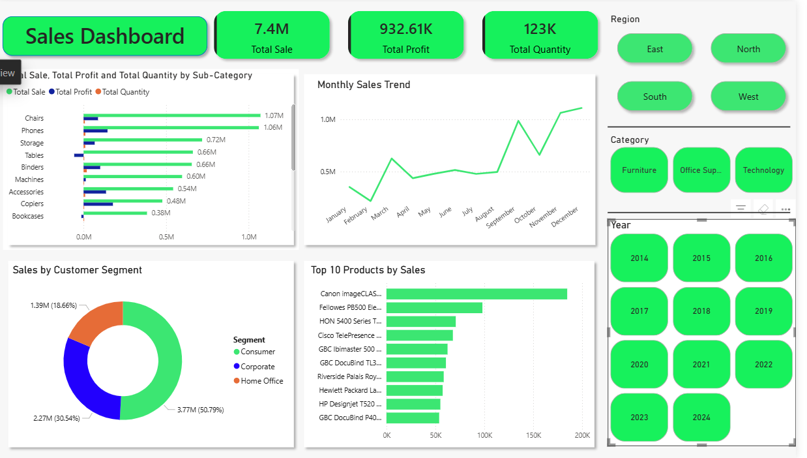

# 🧾 Power BI Sales Dashboard



## 📊 Overview

This interactive **Sales Dashboard** is built using **Power BI** to visualize and analyze company sales performance across different dimensions like:
- Region
- Category
- Year
- Product Sub-Category
- Customer Segments

The dashboard provides quick insights into total sales, profit, quantity, trends over time, top products, and customer behavior.

---

## ✅ Features

- 📈 **Total Metrics**: 
  - Total Sales: `7.4M`
  - Total Profit: `932.61K`
  - Total Quantity: `123K`
  
- 📊 **Visualizations**:
  - Bar chart of sales, profit, and quantity by sub-category
  - Monthly sales trend line chart
  - Donut chart for customer segment-wise sales
  - Top 10 products by sales
  - Filter slicers for Region, Category, and Year

---

## 📁 Dataset

The dashboard is powered by a sample sales dataset which includes the following fields:
- Product Name, Category, Sub-Category
- Sales, Profit, Quantity
- Order Date
- Region, Segment

---

## 🧠 Insights

- **Top Performing Product**: Canon imageCLASS printer leads in sales.
- **Highest Segment**: Consumer segment contributes ~51% of total sales.
- **Sales Trend**: Noticeable peak during November and December.

---

## 🛠 Tools Used

- **Power BI Desktop**
- Data Transformation using Power Query
- DAX Measures and Calculated Columns

---

## 📂 How to Use

1. Clone this repository:
   ```bash
   git clone https://github.com/your-username/sales-dashboard-powerbi.git
